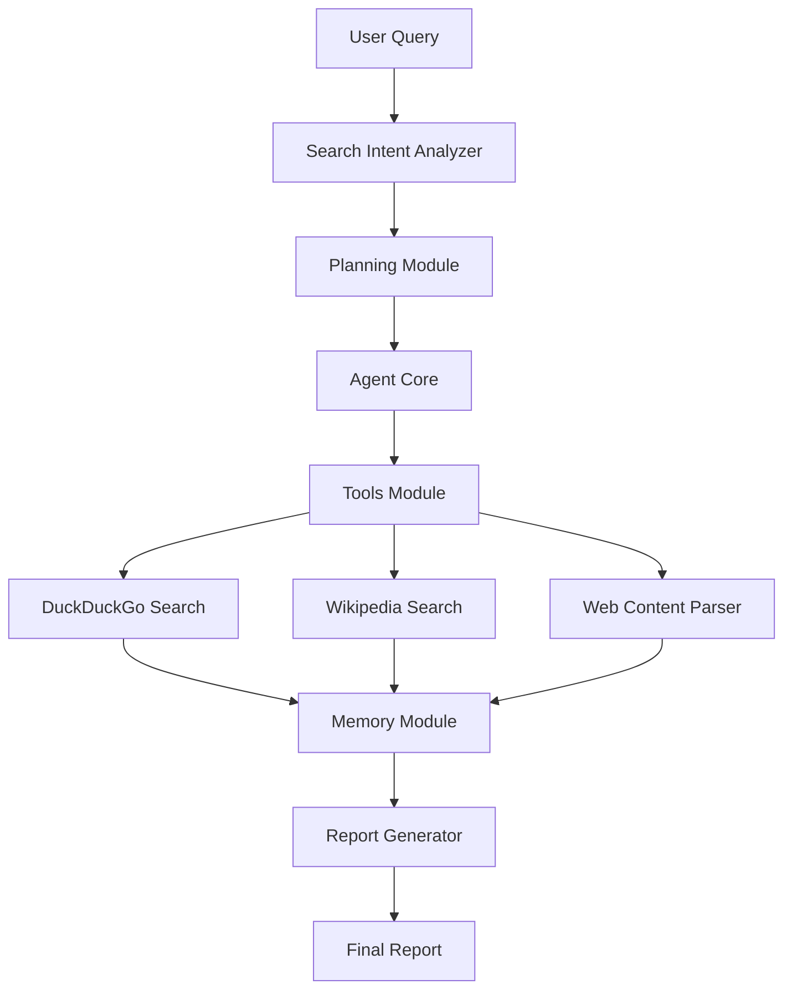

<p align="center">
  
</p>

<h3 align="center">In-Depth Insights. Clear Outcomes.</h3>

## Description

LLMFlow Search Agent is an intelligent research assistant that finds accurate answers to complex questions using advanced search strategies. The agent automatically refines queries, explores multiple information sources, and generates comprehensive reports with proper academic citations.

**Key Features:**
- Search Intent Analyzer optimizes queries for different search engines
- Multi-source search (DuckDuckGo, Wikipedia, web parsing)
- Intelligent planning system with LLM-guided strategy
- Academic-style report generation with numbered citations
- Selenium-based web scraping with caching
- Multiple LLM provider support (OpenAI, Anthropic, Gemini)

<p align="center">
  
</p>

> *Example of a comprehensive report generated by LLMFlow Search Agent*

## Installation

### Prerequisites
- Python 3.9+
- Chrome/Chromium browser
- LLM API key (OpenAI, Anthropic, or Google Gemini)

### Steps
```bash
git clone https://github.com/KazKozDev/LLMFlow-Search.git
cd LLMFlow-Search
pip install -r requirements.txt
echo "OPENAI_API_KEY=your_api_key_here" > .env
```

## Usage

```bash
# Basic usage
python main.py

# With options
python main.py --output report.md --verbose --max-iterations 10
```

**Configuration** - Create `config.json`:
```json
{
    "llm": {
        "provider": "openai",
        "model": "gpt-4o-mini",
        "temperature": 0.2,
        "max_tokens": 4096
    },
    "search": {
        "max_results": 5,
        "parse_top_results": 3,
        "use_selenium": true,
        "use_cache": true
    }
}
```

## Testing

```bash
# Run tests
python -m pytest

# With coverage
python -m pytest --cov=core --cov=tools

# Verbose testing
python main.py --verbose
```

## Architecture

### Core Components
- **Agent Core**: Central coordinator managing information flow
- **LLM Service**: Unified interface for multiple LLM providers (OpenAI, Anthropic, Gemini)
- **Search Intent Analyzer**: Optimizes queries for different search engines
- **Planning Module**: Creates comprehensive search strategies
- **Memory Module**: Manages search context and results
- **Report Generator**: Synthesizes information into academic-style reports

### Search Tools
- **DuckDuckGo Search**: Selenium-based scraping with anti-detection
- **Wikipedia Tool**: Multi-language Wikipedia integration  
- **Web Content Parser**: Intelligent content extraction from web pages

### Data Flow


## Security

- Never commit API keys to version control
- Use `.env` files for sensitive configuration
- All user inputs are validated and sanitized
- HTTPS-only connections for external requests

**Reporting Vulnerabilities:** Email security concerns to maintainers, do not create public issues.

## Code of Conduct

- Use welcoming and inclusive language
- Be respectful of differing viewpoints
- Accept constructive criticism gracefully
- Focus on what is best for the community

## Contributing

### Development Setup
```bash
# Fork repository and setup
python -m venv venv
source venv/bin/activate  # Windows: venv\Scripts\activate
pip install -r requirements.txt
```

### Code Quality Requirements
- **PEP8/flake8 compliance**: 79 characters max, proper imports
- **Documentation**: All public functions must have docstrings
- **Testing**: Unit tests required for core functionality
- **Error handling**: Use specific exceptions, no bare `except:`

### Submitting Changes
1. Create feature branch: `git checkout -b feature/your-feature`
2. Run linting: `flake8 .`
3. Run tests: `python -m pytest`
4. Submit pull request with clear commit messages

## License

MIT License - see [LICENSE](LICENSE) file for details.

## Contact

- **GitHub Issues**: [Project Issues](https://github.com/KazKozDev/LLMFlow-Search/issues)
- **LinkedIn**: [Artem KK](https://www.linkedin.com/in/kazkozdev/)

---

⭐ If you find this project helpful, please give it a star
