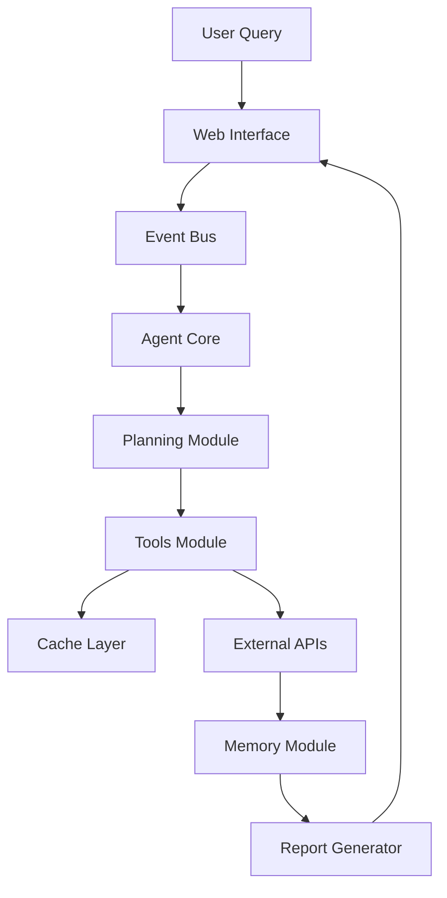

<p align="center">
  
</p>

<h4 align="center">In-Depth Insights. Clear Outcomes.</h4>

LLMFlow Search Agent is an intelligent research assistant that finds accurate answers to complex questions using advanced search strategies. The agent automatically refines queries, explores multiple information sources, and generates comprehensive reports with proper academic citations. 

Completely free — runs locally with Ollama using qwen3:8B model, requiring no registration, API keys, or subscriptions, working out of the box for unlimited research queries.  Perfect for anyone who works with information and values privacy: students, researchers, analysts, consultants, journalists, product managers, startups, and knowledge workers.

<p align="center">
  
</p>

**Key Features:**
- **Advanced Search Intent Analyzer**: Optimizes queries for different search engines
- **Multi-Source Search**: 9 specialized tools including DuckDuckGo, Wikipedia, ArXiv, YouTube, PubMed, etc.
- **Intelligent Planning**: LLM-guided strategy with dynamic plan revision
- **Real-Time Web UI**: WebSocket-based interface with live progress updates
- **High Performance**: Async-first architecture, caching, and resource pooling (30-50x faster init)
- **Robust Architecture**: LLM Gateway, Event Bus, and centralized configuration
- **Observability**: Built-in metrics dashboard and background job system

<p align="center">
  
</p>
> *Example of a comprehensive report generated by LLMFlow Search Agent*

## Installation

### Prerequisites
- Python 3.9+
- Chrome/Chromium browser (for Selenium)
- LLM API key (OpenAI, Anthropic, Google Gemini, or local Ollama)

### Steps
```bash
git clone https://github.com/KazKozDev/LLMFlow-Search.git
cd LLMFlow-Search
pip install -r requirements.txt
```

## Usage

### Web Interface (Recommended)
Start the web server with real-time UI:
```bash
python web_server.py
```
Open **http://localhost:8000** in your browser.

### CLI Usage
```bash
# Basic usage
python main.py

# With options
python main.py --output report.md --verbose --max-iterations 10
```

**Configuration** - Create `config.json`:
```json
{
    "llm": {
        "provider": "ollama",
        "model": "qwen3:8b",
        "temperature": 0.2,
        "max_tokens": 4096
    },
    "search": {
        "max_results": 5,
        "parse_top_results": 3,
        "use_selenium": true
    },
    "cache": {
        "provider": "sqlite",
        "ttl_seconds": 86400
    }
}
```

## Testing

```bash
# Run tests
python -m pytest

# With coverage
python -m pytest --cov=core --cov=tools
```

## Architecture

### Core Components
- **Agent Core**: Central coordinator managing information flow
- **LLM Gateway**: Centralized LLM access with caching, metrics, and fallback
- **Agent Factory**: Manages lifecycle and shared resources (singleton pattern)
- **Event Bus**: Real-time communication system for UI updates
- **Memory Module**: Semantic search and context management
- **Planning Module**: Creates and revises search strategies

### Search Tools
- **General**: DuckDuckGo, SearXNG
- **Academic/Books**: ArXiv, PubMed, Project Gutenberg
- **Knowledge**: Wikipedia, Wayback Machine
- **Media/Maps**: YouTube, OpenStreetMap

### Monitoring & Admin
The web interface includes an **Admin Panel** (`/admin`) featuring:
- **System Metrics**: Cache hit rates, LLM latency, error rates
- **Background Jobs**: Queue management for long-running searches

### Data Flow


## Security

- Never commit API keys to version control
- Use `.env` files for sensitive configuration
- All user inputs are validated and sanitized
- HTTPS-only connections for external requests

**Reporting Vulnerabilities:** Email security concerns to maintainers, do not create public issues.

## Code of Conduct

- Use welcoming and inclusive language
- Be respectful of differing viewpoints
- Accept constructive criticism gracefully
- Focus on what is best for the community

## Contributing

### Development Setup
```bash
# Fork repository and setup
python -m venv venv
source venv/bin/activate  # Windows: venv\Scripts\activate
pip install -r requirements.txt
```

### Code Quality Requirements
- **PEP8/flake8 compliance**: 79 characters max, proper imports
- **Documentation**: All public functions must have docstrings
- **Testing**: Unit tests required for core functionality
- **Error handling**: Use specific exceptions, no bare `except:`

### Submitting Changes
1. Create feature branch: `git checkout -b feature/your-feature`
2. Run linting: `flake8 .`
3. Run tests: `python -m pytest`
4. Submit pull request with clear commit messages

## License

MIT License - see [LICENSE](LICENSE) file for details.

## Contact

- **GitHub Issues**: [Project Issues](https://github.com/KazKozDev/LLMFlow-Search/issues)
- **LinkedIn**: [Artem KK](https://www.linkedin.com/in/kazkozdev/)

---

⭐ If you find this project helpful, please give it a star
