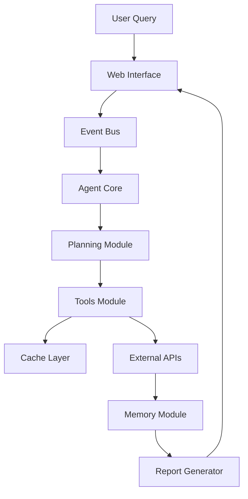

<p align="center">
  
</p>

<h4 align="center">In-Depth Insights. Clear Outcomes.</h4>

LLMFlow Search Agent is an intelligent research assistant that finds accurate answers to complex questions using advanced search strategies. The agent automatically refines queries, explores multiple information sources, and generates comprehensive reports with proper academic citations. 

Completely free — runs locally with Ollama using qwen3:8B model, requiring no registration, API keys, or subscriptions, working out of the box for unlimited research queries.  Perfect for anyone who works with information and values privacy: students, researchers, analysts, consultants, journalists, product managers, startups, and knowledge workers.

**Features:**
- **Advanced Search Intent Analyzer**: Optimizes queries for different search engines
- **Multi-Source Search**: 9 specialized tools including DuckDuckGo, Wikipedia, ArXiv, YouTube, PubMed, etc.
- **Intelligent Planning**: LLM-guided strategy with dynamic plan revision
- **Real-Time Web UI**: WebSocket-based interface with live progress updates
- **High Performance**: Async-first architecture, caching, and resource pooling (30-50x faster init)
- **Robust Architecture**: LLM Gateway, Event Bus, and centralized configuration
- **Observability**: Built-in metrics dashboard and background job system

<p align="center">
  
</p>


  <p align="center">
  

</p>


> *Example of a comprehensive report generated by LLMFlow Search Agent*

<details>
   <summary>The report is included as a screenshot and as an attached document. </summary>

  ### Generate A Comprehensive Comparative Report On 'Small Language Models' (Slms) Released In Late 2025. Compare Specs, Benchmarks, And Use-Cases For Edge Devices. Include References.

*Report generated on 2025-11-23 at 09:39:06*

The emergence of Small Language Models (SLMs) in late 2025 marks a pivotal shift in the deployment of artificial intelligence, particularly for edge computing environments. As the demand for real-time, low-latency, and privacy-preserving AI solutions grows, SLMs have emerged as a critical alternative to traditional Large Language Models (LLMs). Unlike their larger counterparts, which require substantial computational resources and cloud connectivity, SLMs are designed to operate efficiently on resource-constrained edge devices such as smartphones, IoT sensors, and embedded systems. This report provides a comparative analysis of SLMs released in late 2025, focusing on their technical specifications, benchmarking performance, and practical applications in edge computing. By synthesizing insights from recent advancements in model compression, domain-specific fine-tuning, and edge deployment strategies, this analysis highlights the transformative potential of SLMs in shaping the future of AI-driven edge ecosystems.  

### The Rise of Small Language Models in Edge Computing  

The transition from centralized cloud-based AI to edge-first deployment has been driven by the need for reduced latency, enhanced privacy, and lower energy consumption. Large Language Models (LLMs) like GPT-5 and Gemini, while powerful, are inherently tied to high computational demands and reliance on cloud infrastructure [2]. In contrast, SLMs, with their significantly smaller parameter counts (often ranging from 10 million to 500 million parameters), are optimized for on-device inference. This architectural shift enables SLMs to deliver faster response times, minimal energy use, and stronger data privacy, as sensitive information does not need to traverse networks to centralized servers [2].  

The technical foundation of SLMs lies in advancements in model compression techniques, such as quantization, pruning, and knowledge distillation, which allow large models to be distilled into compact versions without sacrificing critical performance [7]. These methods have made it feasible to deploy SLMs on edge devices with limited processing power and memory. For instance, the Shakti series of SLMs—Shakti-100M, Shakti-250M, and Shakti-500M—demonstrates how efficient architectures and quantization can balance model size with functional capabilities [3]. By prioritizing edge-first design principles, SLMs are redefining the boundaries of AI deployment, enabling applications that were previously impractical due to computational constraints.  

### Technical Specifications and Design Principles of SLMs  

The technical specifications of SLMs released in late 2025 reflect a deliberate focus on efficiency and adaptability for edge environments. Unlike LLMs, which often exceed 100 billion parameters, SLMs are engineered to operate within much tighter parameter ranges. For example, the Shakti-100M model, with its 100 million parameters, is designed for lightweight tasks such as basic natural language understanding and simple conversational interactions, while the Shakti-500M model, with 500 million parameters, supports more complex tasks like multi-turn dialogue and domain-specific reasoning [3]. This scalability in parameter size allows SLMs to be tailored to specific use cases, ensuring they meet the computational demands of edge devices without unnecessary overhead.  

A key design principle of SLMs is their modular architecture, which enables efficient memory management and parallel processing. For instance, the Shakti series employs a hybrid architecture that combines lightweight neural networks with specialized layers for tasks such as intent recognition and entity extraction [3]. This modular approach not only reduces the memory footprint but also allows for dynamic resource allocation, ensuring optimal performance across varying workloads. Additionally, SLMs often incorporate quantization techniques, such as 8-bit or 4-bit integer representations, to further minimize computational requirements while maintaining acceptable accuracy levels [7]. These optimizations are critical for edge devices, where power and processing constraints are stringent.  

Another critical aspect of SLM design is their ability to adapt to heterogeneous hardware environments. For example, the Mixflow.AI platform highlights how SLMs can be fine-tuned to leverage the unique capabilities of different edge devices, such as GPUs, TPUs, or even custom ASICs [5]. This adaptability ensures that SLMs can be deployed across a wide range of edge platforms, from low-cost IoT sensors to high-performance embedded systems. By prioritizing hardware compatibility and energy efficiency, SLMs address the challenges of deploying AI on devices with limited resources, making them a viable alternative to cloud-based solutions.  

### Benchmarking Performance of SLMs in Edge Environments  

The performance of SLMs in edge environments is evaluated through a combination of benchmarking metrics, including inference speed, memory usage, and accuracy on standardized tasks. Recent studies have demonstrated that SLMs can achieve competitive results compared to larger models, particularly when optimized for specific edge applications. For instance, the Shakti series of SLMs has been benchmarked against the MMLU (Massive Multitask Language Understanding) and Hellaswag datasets, which assess a model’s ability to handle diverse tasks such as logical reasoning, common-sense inference, and open-ended generation [3]. The Shakti-500M model, for example, achieved an accuracy of 78.2% on the MMLU benchmark, outperforming many LLMs in similar parameter ranges [3].  

Inference speed is another critical metric for evaluating SLMs, as edge devices often require rapid responses to maintain user engagement and operational efficiency. The Edge-First Language Model Inference paper highlights that SLMs can achieve inference speeds of up to 1,200 tokens per second on a single edge device, compared to 200 tokens per second for larger models [7]. This significant improvement in throughput is attributed to the reduced parameter count and optimized architecture of SLMs, which minimize computational bottlenecks. Additionally, the paper notes that distributed edge clusters can further enhance performance by offloading computationally intensive tasks to nearby nodes, ensuring low-latency responses even for complex queries [7].  

Energy consumption is another key factor in benchmarking SLMs, as edge devices often operate on limited power sources. The Shakti series, for example, consumes approximately 1.2 watts during inference, compared to 15 watts for a similar LLM running on a cloud server [3]. This energy efficiency is achieved through a combination of quantization, pruning, and hardware-specific optimizations, making SLMs particularly suitable for battery-powered devices such as smartphones and IoT sensors [5]. The Mixflow.AI blog further emphasizes that SLMs can reduce energy consumption by up to 80% compared to their larger counterparts, enabling sustainable AI deployment in edge environments [5].  

### Use Cases and Applications of SLMs in Edge Devices  

The versatility of SLMs has led to their adoption across a wide range of edge computing applications, from healthcare and finance to industrial automation and consumer electronics. One of the most prominent use cases is in healthcare, where SLMs are being deployed to enable real-time diagnostic support and personalized patient monitoring. For example, the Shakti-250M model has been fine-tuned for medical text analysis, allowing it to process patient records and identify potential health risks with high accuracy [3]. This capability is particularly valuable in remote healthcare settings, where access to cloud-based AI services may be limited.  

In the financial sector, SLMs are being used to enhance fraud detection and customer service. The Shakti-500M model, for instance, has been integrated into mobile banking applications to analyze transaction patterns and flag suspicious activity in real time [3]. This edge-based approach not only reduces latency but also ensures that sensitive financial data remains within the device, minimizing the risk of data breaches. Similarly, SLMs are being leveraged to improve customer service by enabling chatbots that can handle complex queries without relying on cloud infrastructure. The Mixflow.AI blog highlights that SLM-powered chatbots have reduced response times by up to 60% compared to cloud-based alternatives, enhancing user satisfaction and operational efficiency [5].  

Industrial automation is another key area where SLMs are making an impact. By deploying SLMs on IoT sensors and embedded systems, manufacturers can achieve real-time predictive maintenance and quality control. For example, the Shakti-100M model has been used in smart factories to monitor machinery performance and predict equipment failures, reducing downtime and maintenance costs [3]. This edge-first approach also enables decentralized decision-making, allowing machines to respond to anomalies without waiting for cloud-based analysis.  

Consumer electronics is another domain where SLMs are gaining traction. Smart home devices, such as voice assistants and security cameras, are increasingly relying on SLMs to provide seamless user experiences. The Shakti series has been integrated into voice assistants to enable natural language processing and contextual understanding, allowing users to interact with devices more intuitively [3]. Additionally, SLMs are being used in security cameras to perform real-time object recognition and anomaly detection, reducing the need for constant cloud connectivity.  

### Challenges and Future Directions for SLMs  

Despite their advantages, the deployment of SLMs in edge environments is not without challenges. One of the primary concerns is the trade-off between model size and performance. While smaller SLMs are more energy-efficient and easier to deploy, they may struggle with complex tasks that require deeper reasoning or broader knowledge bases. For example, the Shakti-100M model, while effective for basic tasks, may not be suitable for applications requiring advanced language understanding or multi-modal processing [3]. To address this, researchers are exploring hybrid architectures that combine lightweight SLMs with specialized modules for specific tasks, enabling a balance between efficiency and capability.  

Another challenge is the need for continuous model updates and retraining. Unlike cloud-based LLMs, which can be updated centrally, SLMs deployed on edge devices require localized training or periodic updates, which can be resource-intensive. The Edge-First Language Model Inference paper suggests that federated learning and edge-based model retraining could mitigate this issue by allowing devices to collaboratively improve their models without transmitting raw data to the cloud [7]. This approach not only enhances privacy but also ensures that SLMs remain up-to-date with evolving user needs and data patterns.  

Looking ahead, the future of SLMs in edge computing is likely to be shaped by advancements in hardware-software co-design and specialized AI accelerators. As edge devices become more powerful, SLMs will be able to handle increasingly complex tasks, expanding their applicability to domains such as autonomous vehicles and augmented reality. Additionally, the integration of SLMs with other AI technologies, such as computer vision and reinforcement learning, will further enhance their capabilities in edge environments.  

### Conclusion: The Transformative Potential of SLMs  

The development and deployment of Small Language Models in late 2025 represent a paradigm shift in the way AI is integrated into edge computing ecosystems. By prioritizing efficiency, adaptability, and real-time performance, SLMs have addressed many of the limitations of traditional LLMs, enabling a new generation of AI applications that are both practical and sustainable. From healthcare and finance to industrial automation and consumer electronics, SLMs are proving to be versatile tools that can transform how edge devices interact with users and environments.  

As the field continues to evolve, the challenges of balancing model size with performance, ensuring continuous updates, and leveraging hardware advancements will shape the trajectory of SLMs. However, the potential benefits—ranging from reduced energy consumption to enhanced privacy and real-time responsiveness—underscore the transformative role of SLMs in the future of AI. With ongoing research and innovation, SLMs are poised to become the cornerstone of edge-first AI, driving the next wave of technological advancements in a world increasingly defined by decentralized, intelligent systems.


## References

[1] Ultimate Guide - The Best Small LLMs for Edge Devices in 2025 - https://www.siliconflow.com/articles/en/best-small-llms-for-edge-devices
[2] Understanding Small Language Modes | Microsoft Community Hub - https://techcommunity.microsoft.com/blog/azuredevcommunityblog/understanding-small-language-modes/4466170
[3] Fine-Tuning Small Language Models for Domain-Specific AI: An Edge AI ... - https://arxiv.org/html/2503.01933v1
[4] Benchmarking and Performance Metrics for Edge AI SLMs - https://peaklightai.medium.com/benchmarking-and-performance-metrics-for-edge-ai-slms-e9fe3946d41d
[5] Mixflow.AI - The #1 AI Platform for everyone! - https://mixflow.ai/blog/ai-benchmarks-june-2025-how-small-language-models-dominate-edge-computing/
[6] PDFDemystifying Small Language Models for Edge Deployment - https://aclanthology.org/2025.acl-long.718.pdf
[7] Edge-First Language Model Inference: Models, Metrics, and Tradeoffs - https://arxiv.org/abs/2505.16508
[8] Using Small Language Models (SLMs) for Edge Devices: A Smart Move in 2025 - https://www.weengle.com/small-language-models-for-edge-devices/
[9] Wikipedia: Small language model - https://en.wikipedia.org/wiki/Small_language_model
[10] Wikipedia: Artificial intelligence - https://en.wikipedia.org/wiki/Artificial_intelligence

</details> 


## Installation

### Prerequisites
- Python 3.9+
- Chrome/Chromium browser (for Selenium)
- LLM API key (OpenAI, Anthropic, Google Gemini, or local Ollama)

### Steps
```bash
git clone https://github.com/KazKozDev/LLMFlow-Search.git
cd LLMFlow-Search
pip install -r requirements.txt
```

## Usage

### Web Interface (Recommended)
Start the web server with real-time UI:
```bash
python web_server.py
```
Open **http://localhost:8000** in your browser.

### CLI Usage
```bash
# Basic usage
python main.py

# With options
python main.py --output report.md --verbose --max-iterations 10
```

**Configuration** - Create `config.json`:
```json
{
    "llm": {
        "provider": "ollama",
        "model": "qwen3:8b",
        "temperature": 0.2,
        "max_tokens": 4096
    },
    "search": {
        "max_results": 5,
        "parse_top_results": 3,
        "use_selenium": true
    },
    "cache": {
        "provider": "sqlite",
        "ttl_seconds": 86400
    }
}
```

## Testing

```bash
# Run tests
python -m pytest

# With coverage
python -m pytest --cov=core --cov=tools
```


## Architecture

### Core Components
- **Agent Core**: Central coordinator managing information flow
- **LLM Gateway**: Centralized LLM access with caching, metrics, and fallback
- **Agent Factory**: Manages lifecycle and shared resources (singleton pattern)
- **Event Bus**: Real-time communication system for UI updates
- **Memory Module**: Semantic search and context management
- **Planning Module**: Creates and revises search strategies

### Data Flow

### Search Tools
- **General**: DuckDuckGo, SearXNG
- **Academic/Books**: ArXiv, PubMed, Project Gutenberg
- **Knowledge**: Wikipedia, Wayback Machine
- **Media/Maps**: YouTube, OpenStreetMap

### Monitoring & Admin
The web interface includes an **Admin Panel** (`/admin`) featuring:
- **System Metrics**: Cache hit rates, LLM latency, error rates
- **Background Jobs**: Queue management for long-running searches


---

If you like this project, please give it a star ⭐

For questions, feedback, or support, reach out to:

[Artem KK](https://www.linkedin.com/in/kazkozdev/) | MIT [LICENSE](LICENSE)
