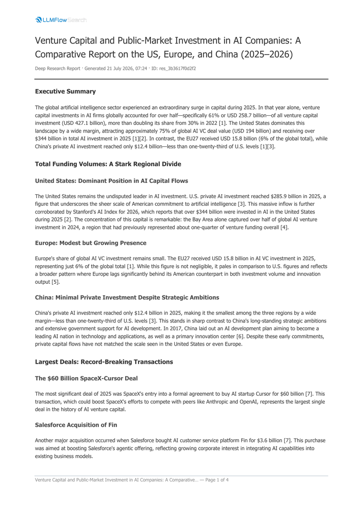

<a href="https://github.com/KazKozDev/llmflow-search/actions/workflows/ci.yml"></a>
<a href="https://codecov.io/gh/KazKozDev/llmflow-search"></a>
<br>
<a href="https://www.python.org/downloads/"></a>
<a href="LICENSE"></a>

<p align="center">
  <br>
  
  <br><br>
  <strong>Deep Research on a local model — every claim traced to its source</strong>
  <br><br>
</p>

The idea was to build a Deep Research pipeline that runs entirely on a local LLM instead of a cloud model.

A local, evidence-first, multi-agent deep-research CLI: it runs `ornith:9b` through Ollama, splits the question into parallel research tasks handled by separate agents, searches a local SearXNG instance, and writes every claim to a SQLite evidence store before a fact checker is allowed to touch it. The report can only cite sources that made it through that store — the model never gets to assert a fact straight from a search snippet.

```text
question
  → planner agent (up to 3 tasks)
  → 3 parallel research agents → SearXNG search + page reading
  → SQLite evidence store
  → fact-checking agent (verified / conflicting / insufficient / rejected)
  → writer agent → Markdown + PDF report
  → citation validator → citations checked against the store
```

That ordering is the whole design priority: extraction is separated from verification, and the writer is confined to sources it can prove came from a stored, cited page. The orchestrator-workers architecture and role split are adapted from Anthropic's own published research on multi-agent systems — see the references at the end of this README.

## Installation

Prerequisites: Docker Desktop, [`uv`](https://docs.astral.sh/uv/), and Ollama.

```bash
ollama pull ornith:9b
```

The default `config.example.yaml` needs two more things installed separately, outside this repo, before a run can succeed:

1. **[SearXNG](https://docs.searxng.org/)** (search engine) — its Docker Compose file and settings live in this repo at [searxng/docker-compose.yml](searxng/docker-compose.yml) / [searxng/settings.yml](searxng/settings.yml), but the container itself is brought up as a separate step, below.
2. **[`footnote-mcp`](https://github.com/KazKozDev/footnote-mcp)** — a separate MCP server, not part of this repo. `config.example.yaml` sets it as `search.fallback_provider` by default, so it's expected to be installed with its executable path set in `search.footnote.command`, even though SearXNG is the primary provider.

```bash
pip install footnote-mcp
python -m playwright install chromium   # headless browser used by the fetch fallback
```

Then point `search.footnote.command` in `config.yaml` at the installed `footnote-mcp` executable (e.g. `which footnote-mcp`).

```bash
cd /path/to/llmflow-search
uv sync --all-groups
test -f config.yaml || cp config.example.yaml config.yaml
docker compose -f searxng/docker-compose.yml up -d
```

`uv sync` builds the virtualenv and installs the project in editable mode. `cp` creates your local `config.yaml` from the example on first run. Compose starts SearXNG on `127.0.0.1:8080`.

Confirm the local search API is up:

```bash
curl 'http://localhost:8080/search?q=LLM&format=json'
```

## Quick launch on macOS

Once SearXNG and `footnote-mcp` are in place, double-click [RUN_DEEP_RESEARCH.command](RUN_DEEP_RESEARCH.command) in Finder instead of running commands by hand. It resolves its own directory (`${0:A:h}`), so the project can live anywhere — no path to edit. It then:

1. creates `config.yaml` from `config.example.yaml` if missing;
2. runs `uv sync --all-groups`;
3. starts local SearXNG via Docker Compose (restarts a wedged Docker daemon if needed);
4. runs a live smoke check — Ollama structured inference, search, SQLite writes;
5. offers to resume an interrupted run, or asks for a new research topic;
6. shows the plan, queries, sources, fact-checking, and final report in Terminal.

## Run from a terminal

```bash
uv run deep-research run "Compare local RAG frameworks"
```

Runs the research and, once finished, prints the research ID and the full Markdown report.

## Example report

<a href="assets/example-report.pdf"></a>

Query: *"Compare venture capital and public-market investment in AI companies across the US, Europe, and China in 2025-2026: total funding volumes, largest deals, government subsidies/industrial policy, and which region is pulling ahead."*

Click the preview to open the [full PDF report](assets/example-report.pdf) — every bracketed citation resolves to a source that made it through the evidence store.

## What happens during research

Every role is a separate task with its own prompt, but by default all of them call the same local model, `ornith:9b`:

- the planner generates up to three independent search directions;
- researchers query SearXNG, read the pages found, and extract cited claims;
- current/news queries are automatically scoped to the current month and year;
- source ranking favors each task's stated source-type preferences, known official domains, institutional sources, repositories, and reputable news domains;
- sources are deduplicated; the evidence store keeps URL, extracted text, citation, source quality, and verification status per item;
- the fact checker assigns each statement `verified`, `conflicting`, `insufficient`, or `rejected`;
- the report only admits verified evidence with `source_quality >= 0.65` ([`orchestrator.py:24`](src/deep_research/orchestrator.py:24)), unless a claim has independent corroboration;
- the writer may only reference sources already admitted into the evidence store for that research ID;
- the citation validator — deterministic code, no LLM call — rewrites internal citation markers into real Markdown links and rejects any citation it can't resolve to a stored source ([`citations.py`](src/deep_research/citations.py)).

Terminal progress during a run:

```text
[12:57:28] STAGE: researching
[12:57:28] PLAN: tasks created — 3
[12:57:28] SEARCH [task_...]: query queued — ...
[12:58:04] READ [task_...]: ...
```

## Configuration

Copy [config.example.yaml](config.example.yaml) to `config.yaml` on first run (the launcher does this automatically).

```yaml
models:
  analyzer: ornith:9b   # same model for all five roles by default: planner, researcher, fact_checker, writer

ollama:
  keep_alive: -1        # keep the model resident between requests
  num_predict: 8192      # hard cap on generated tokens per response
  think: false           # disable thinking tokens for thinking models (unconstrained by the JSON schema otherwise)

search:
  provider: searxng
  base_url: http://localhost:8080
  fallback_provider: footnote_mcp   # optional, see below

runtime:
  max_research_workers: 3

output:
  reports_dir: reports              # every completed run's report is also saved here as a PDF
  logo_path: assets/images/llmflow.png
```

`footnote-mcp` (see Installation) can also replace SearXNG outright — set `search.provider: footnote_mcp` instead of using it as a fallback.

## CLI

```bash
uv run deep-research run "research question"
uv run deep-research run "research question" --quiet
uv run deep-research run "research question" --no-report
uv run deep-research resume res_...
uv run deep-research resumable
uv run deep-research status res_...
uv run deep-research report res_... > reports/report.md
```

`run` prints progress and the final report. `--quiet` suppresses progress output, `--no-report` prints only the research ID. `resume` continues an interrupted run from its last checkpoint — `resumable` prints the ID of the most recent one, if any. `status` reads the persisted run state from SQLite; `report` re-prints a saved report.

## Key files

- [`src/deep_research/orchestrator.py`](src/deep_research/orchestrator.py) — research states, task fan-out, the 0.65 source-quality gate.
- [`src/deep_research/agents.py`](src/deep_research/agents.py) — planner, research worker, fact checker.
- [`src/deep_research/tools.py`](src/deep_research/tools.py) — SearXNG, HTTP page fetching, the `footnote-mcp` fallback.
- [`src/deep_research/store.py`](src/deep_research/store.py) — the SQLite evidence store.
- [`src/deep_research/citations.py`](src/deep_research/citations.py) — citation validation and Markdown rendering.
- [`src/deep_research/pdf_report.py`](src/deep_research/pdf_report.py) — PDF rendering of the final report.

## Tests and lint

```bash
uv run pytest
uv run ruff check .
```

Tests currently pass 74/74. Ruff currently reports 3 `E501` (line too long) findings in [`pdf_report.py`](src/deep_research/pdf_report.py) — long font-path tuples and an inline CSS string.

## Benchmark and production smoke

The benchmark checks report properties, not writing style: number of Markdown citations, required keywords, and required source domains per case. Cases are JSONL; an example set is in [benchmarks/cases.example.jsonl](benchmarks/cases.example.jsonl) — it's a starter kit, not a full suite, and should be expanded with real verified questions before relying on it.

```bash
uv run deep-research benchmark \
  --cases benchmarks/cases.example.jsonl \
  --output benchmarks/results/latest.json
```

The runner executes each question as a real research run, persists it to SQLite, and writes JSON with `passed_count`, the citations found, the domains cited, and any missing criteria per case.

Production smoke checks the live path without a full research run: required Ollama models are present, structured inference works, SearXNG returns results and a page can be fetched, and SQLite writes succeed.

```bash
uv run deep-research smoke
```

Exits non-zero if any check fails. `RUN_DEEP_RESEARCH.command` runs this gate before it will accept a research topic.

## Failure behavior

There are no model-output fallbacks. Planner, extraction, fact-checking, and report-writing failures are persisted with status `failed` and printed to the terminal. A run also fails if it produces no source-backed evidence or no verified evidence — it cannot reach `completed` without a citation-validated report built exclusively from verified sources. Fact-checking runs in small sequential batches and reports progress per batch; cancelling a run persists it as `failed` rather than leaving it stuck.

## Limitations

SearXNG is a metasearch layer: results depend on the availability and quality of the external engines it queries. Running SearXNG locally does not make internet sources reliable by itself — the system keeps every claim tied to its source and evidence status instead of treating a snippet as confirmed.

This project has only been tested against `ornith:9b`. Other Ollama models haven't been tried, and it's unknown how they'd behave for planning, extraction, or fact-checking — prompts and structured-output parsing may need adjustment for a different model.

## References

- [How we built our multi-agent research system](https://www.anthropic.com/engineering/multi-agent-research-system) — orchestrator-workers pattern, effort scaled to query complexity, parallel subagents as intelligent filters.
- [Building Effective AI Agents](https://www.anthropic.com/engineering/building-effective-agents) — workflow vs. agent patterns, orchestrator-workers, evaluator-optimizer.
- [Introducing web search on the Anthropic API](https://claude.com/blog/web-search-api) — search-then-cite loop this project's fact-checking pipeline follows locally.

## License

MIT — see [LICENSE](LICENSE)

If you like this project, please give it a star ⭐

For questions, feedback, or support, reach out to:

[LinkedIn](https://www.linkedin.com/in/kazkozdev/) · [Email](mailto:KazKozDev@gmail.com)
