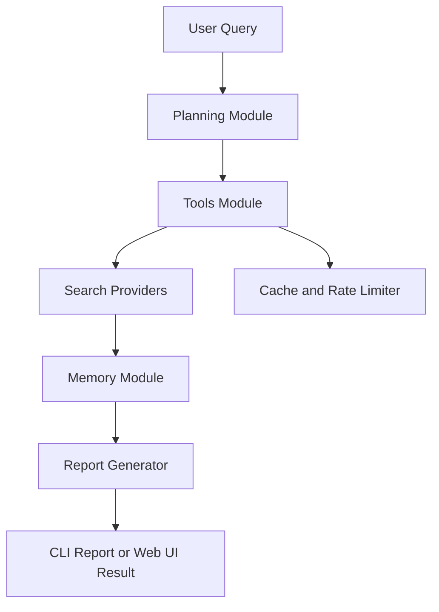

<div align="center">
  


  <p>
    LLMFlow Search breaks your question into a search plan, runs it across 9 sources from DuckDuckGo to ArXiv,<br/>
    parses relevant pages and assembles a markdown report with references. All local, all yours.
  </p>


  <p>
    
    
  </p>

  
</div>

## Highlights

- Multi-source search across nine specialized tools
- CLI and FastAPI interfaces in one codebase
- Real-time progress streaming over WebSockets
- Background deep-search jobs with queue tracking
- Local-first Ollama default with provider flexibility

## Demo

<p align="center">
  
</p>

<p align="center">
  
</p>

## Why

ChatGPT, Claude, and Gemini all have deep research workflows, but they are tied to their API, their search stack, and their pricing. Swap the model and you have to rework the pipeline. Add a source like PubMed and you are back in implementation details instead of research.

LLMFlow Search keeps the same overall pipeline, but the LLM provider and search sources live in configuration instead of hardcoded integrations. You can run Ollama locally, switch to OpenAI in the cloud, or plug in your own SearXNG instance through one entry point.

## What's Inside

- Pipeline: builds a search plan, revises it on the fly, explores alternate query paths, runs parallel search across sources, parses results, and generates a report.
- 9 sources: DuckDuckGo, Wikipedia, SearXNG, ArXiv, PubMed, YouTube, Gutenberg, OpenStreetMap, and Wayback.
- Infrastructure: SQLite cache, per-source rate limiting, background job queue, WebSocket live progress, and metrics endpoint for system and LLM telemetry.

## Architecture

Components:
- `main.py` drives the interactive CLI workflow.
- `web_server.py` exposes the FastAPI API, WebSocket stream, and static UI.
- `core/agent_factory.py` initializes shared cache and LLM resources.
- `core/planning_module.py` builds and revises the search plan.
- `core/tools_module.py` dispatches search tools with caching and rate limits.
- `core/memory_module.py` stores gathered results for later synthesis.
- `core/report_generator.py` produces the final markdown report.

Flow: Query -> planning -> tool execution -> parsing and memory -> report generation -> CLI output or streamed web result


```mermaid
graph TD
    A[User Query] --> B[Planning Module]
    B --> C[Tools Module]
    C --> D[Search Providers]
    C --> E[Cache and Rate Limiter]
    D --> F[Memory Module]
    F --> G[Report Generator]
    G --> H[CLI Report or Web UI Result]
```

## Tech Stack

- Python 3.11 runtime in Docker, Python 3.9+ expected locally
- FastAPI and Uvicorn for the web server
- aiohttp and httpx for async network access
- Pydantic for config validation
- Ollama, OpenAI, Anthropic, and Gemini provider hooks
- SQLite caching through aiosqlite
- Selenium and Chromium for browser-assisted retrieval
- pytest for tests

## Quick Start

1. Clone the repository and install dependencies.

```bash
git clone https://github.com/KazKozDev/llmflow-search.git
cd llmflow-search
pip install -r requirements.txt
```

2. Review `config.json` and keep the default `ollama` provider, or switch to another provider and set the matching API key.

3. If you use Ollama, start an Ollama server locally or expose it through `OLLAMA_HOST`.

4. Run the web app or the CLI.

```bash
python web_server.py
```

```bash
python main.py --output reports/report.md --max-iterations 10
```

Detailed setup notes are in [docs/setup.md](docs/setup.md).

## Usage

Run the web interface:

```bash
python web_server.py
```

Run the CLI and save the generated markdown report:

```bash
python main.py --output reports/report.md --verbose --max-iterations 12
```

Start the containerized environment:

```bash
docker compose up --build
```

## API Overview

The web server in `web_server.py` exposes a small HTTP and WebSocket surface for the UI.

- `GET /` serves the static interface from `web/static/index.html`
- `POST /api/search` starts a standard session or queues a deep-search job
- `GET /api/sessions` lists in-memory standard sessions
- `GET /api/tools` returns the available search tools
- `GET /api/metrics` returns system and LLM metrics
- `GET /api/jobs` lists background jobs
- `GET /api/jobs/{job_id}` returns one background job
- `POST /api/jobs/{job_id}/cancel` cancels a running background job
- `WS /ws/search/{session_id}` streams `status`, `progress`, `result`, `complete`, and `error` messages for a standard session

## Project Structure

```text
core/
  caching/         # Cache backends and factory
  tools/           # Search tool implementations and parsers
  agent_factory.py # Shared resource lifecycle
  agent_core.py    # Agent execution loop
  report_generator.py
tests/
  test_agent_react_loop.py
  test_background_jobs.py
  test_tool_usage.py
  test_web_server.py
web/
  static/          # HTML, JS, CSS, and logo
main.py            # Interactive CLI entry point
web_server.py      # FastAPI + WebSocket server
config.json        # Runtime configuration
docker-compose.yml # Container orchestration
```

## Status

Stage: Experimental

Planned:
- TODO: define public roadmap items

## Testing

```bash
python -m pytest tests -q
```

## Contributing

See [CONTRIBUTING.md](CONTRIBUTING.md).

---

MIT - see LICENSE

If you like this project, please give it a star ⭐

For questions, feedback, or support, reach out to:

[LinkedIn](https://www.linkedin.com/in/kazkozdev/)
[Email](mailto:kazkozdev@gmail.com)
