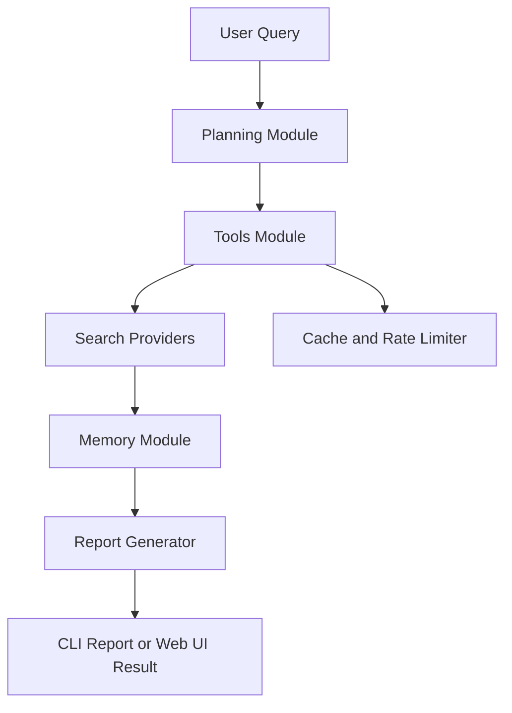

<div align="center">
  


 <p>
    Turns your question into a search plan, runs it across 9 sources, from DuckDuckGo to ArXiv,<br/>
    and assembles a markdown report with references. Fully local. Fully yours.
  </p>


  <p>
    
    
  </p>

 
</div>

## Highlights

- 9 integrated search sources in one pipeline
- Ollama-first setup with no API key required
- CLI, FastAPI, and WebSocket interfaces
- SQLite cache, rate limits, and background jobs
- Markdown reports with references and live progress

## Demo

<p align="center">
  
</p>

<p align="center">
  
</p>

## Why

ChatGPT, Claude, and Gemini all offer deep research workflows, but they are tightly coupled to their own APIs, search stacks, and pricing models. If you want to swap the model, you end up reworking the pipeline. If you want to add a source like PubMed, you are back to implementation details instead of actual research.

LLMFlow Search keeps the same overall workflow, but the LLM provider and search sources are configured rather than hardcoded. You can run Ollama locally, switch to OpenAI in the cloud, or plug in your own SearXNG instance through the same entry point.

## What's Inside

- Pipeline: builds a search plan, revises it on the fly, explores alternate query paths, runs parallel search across sources, parses results, and generates a report.
- 9 sources: DuckDuckGo, Wikipedia, SearXNG, ArXiv, PubMed, YouTube, Gutenberg, OpenStreetMap, and Wayback.
- Infrastructure: SQLite cache, per-source rate limiting, background job queue, WebSocket live progress, and metrics endpoint for system and LLM telemetry.

## Architecture

Components:
- `main.py` drives the interactive CLI workflow.
- `web_server.py` exposes the FastAPI API, WebSocket stream, and static UI.
- `core/agent_factory.py` initializes shared cache and LLM resources.
- `core/planning_module.py` builds and revises the search plan.
- `core/tools_module.py` dispatches search tools with caching and rate limits.
- `core/memory_module.py` stores gathered results for later synthesis.
- `core/report_generator.py` produces the final markdown report.

Flow: Query -> planning -> tool execution -> parsing and memory -> report generation -> CLI output or streamed web result


```mermaid
graph TD
    A[User Query] --> B[Planning Module]
    B --> C[Tools Module]
    C --> D[Search Providers]
    C --> E[Cache and Rate Limiter]
    D --> F[Memory Module]
    F --> G[Report Generator]
    G --> H[CLI Report or Web UI Result]
```

## Tech Stack

- Python 3.11 runtime in Docker, Python 3.9+ expected locally
- FastAPI and Uvicorn for the web server
- aiohttp and httpx for async network access
- Pydantic for config validation
- Ollama, OpenAI, Anthropic, and Gemini provider hooks
- SQLite caching through aiosqlite
- Selenium and Chromium for browser-assisted retrieval
- pytest for tests

## Quick Start

1. Clone the repository and install dependencies.

```bash
git clone https://github.com/KazKozDev/llmflow-search.git
cd llmflow-search
pip install -r requirements.txt
```

2. Review `config.json` and keep the default `ollama` provider, or switch to another provider and set the matching API key.

3. If you use Ollama, start an Ollama server locally or expose it through `OLLAMA_HOST`.

4. Run the web app or the CLI.

```bash
python web_server.py
```

```bash
python main.py --output reports/report.md --max-iterations 10
```

Detailed setup notes are in [docs/setup.md](docs/setup.md).

## Configuration

The runtime is configured through `config.json`, with provider secrets and host overrides coming from environment variables.

Minimal local setup with Ollama:

```json
{
  "llm": {
    "provider": "ollama",
    "model": "qwen3:8b",
    "temperature": 0.2,
    "max_tokens": 4096
  },
  "search": {
    "max_results": 5,
    "parse_top_results": 3,
    "use_selenium": true,
    "use_cache": true
  }
}
```

Environment variables:

| Variable | Required when | Purpose |
| --- | --- | --- |
| `OLLAMA_HOST` | Using Ollama on a non-default host | Points the app to your Ollama server |
| `OPENAI_API_KEY` | `provider: openai` | Enables OpenAI-backed runs |
| `ANTHROPIC_API_KEY` | `provider: anthropic` | Enables Anthropic-backed runs |
| `GEMINI_API_KEY` or `GOOGLE_API_KEY` | `provider: gemini` | Enables Gemini-backed runs |

Provider switching is done by changing `llm.provider` and `llm.model` in `config.json`; the rest of the pipeline stays the same.

## Usage

Interactive CLI run:

```bash
python main.py --output reports/report.md --verbose --max-iterations 12
```

Example prompt:

```text
Compare small language models suitable for offline document search on a Mac.
```

Run the web interface locally:

```bash
python web_server.py
```

Start the containerized environment:

```bash
docker compose up --build
```

Trigger a standard web/API session:

```bash
curl -X POST http://127.0.0.1:8000/api/search \
  -H "Content-Type: application/json" \
  -d '{"query":"Find recent papers on local RAG evaluation","max_iterations":10,"mode":"standard"}'
```

The API returns a `session_id`, and progress then streams over `WS /ws/search/{session_id}`.

## API Overview

The web server in `web_server.py` exposes a small HTTP and WebSocket surface for the UI.

- `GET /` serves the static interface from `web/static/index.html`
- `POST /api/search` starts a standard session or queues a deep-search job
- `GET /api/sessions` lists in-memory standard sessions
- `GET /api/tools` returns the available search tools
- `GET /api/metrics` returns system and LLM metrics
- `GET /api/jobs` lists background jobs
- `GET /api/jobs/{job_id}` returns one background job
- `POST /api/jobs/{job_id}/cancel` cancels a running background job
- `WS /ws/search/{session_id}` streams `status`, `progress`, `result`, `complete`, and `error` messages for a standard session

## Project Structure

```text
core/
  caching/         # Cache backends and factory
  tools/           # Search tool implementations and parsers
  agent_factory.py # Shared resource lifecycle
  agent_core.py    # Agent execution loop
  report_generator.py
tests/
  test_agent_react_loop.py
  test_background_jobs.py
  test_tool_usage.py
  test_web_server.py
web/
  static/          # HTML, JS, CSS, and logo
main.py            # Interactive CLI entry point
web_server.py      # FastAPI + WebSocket server
config.json        # Runtime configuration
docker-compose.yml # Container orchestration
```

## Status

Stage: Experimental

Current state:
- Local-first Ollama workflow works out of the box.
- CLI, web UI, WebSocket streaming, and background deep-search jobs are available.
- Interfaces, configuration details, and tool coverage may still evolve as the project hardens.

## Testing

```bash
python -m pytest tests -q
```

## Contributing

See [CONTRIBUTING.md](CONTRIBUTING.md).

---

MIT - see LICENSE

If you like this project, please give it a star ⭐

For questions, feedback, or support, reach out to:

[LinkedIn](https://www.linkedin.com/in/kazkozdev/)
[Email](mailto:kazkozdev@gmail.com)
